# Checkpoints

## Introduction

When you try to perform a shortcut jump in Mute City: Serial Gaps, sometimes your machine explodes upon landing. Why does that happen? Did you miss a checkpoint?

Well, it's not that simple. First of all, there might be more checkpoints in Serial Gaps than you expected:

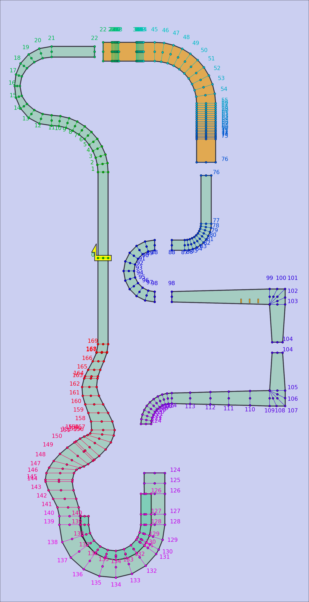

As you run a lap, the game uses the checkpoints to keep track of your progress and make sure you haven't skipped too far ahead. Each course has a different number of checkpoints. Serial Gaps has 170, but there are tracks with under 60 or over 500. The checkpoints follow the track; there are generally more checkpoints on turns compared to straight sections.

When you cross the start line at the start of a race, you're between checkpoints 0 and 1. We'll say your **checkpoint status** is 0 here. Once you cross checkpoint 1, you're between checkpoints 1 and 2, and your checkpoint status is 1. And so on.

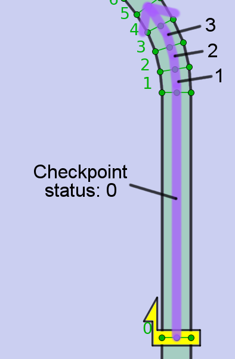

It's easy enough to figure out your checkpoint status when you're on the ground. Things get more interesting when you're in the air. The game gives you some freedom with air movement, so you can still advance your checkpoint status when you're airborne above the track, or even to the side of the track.

To implement this, the checkpoints are actually 3D planes extending infinitely to the side, above, and below. So for example, the jump plate section in Serial Gaps looks something like this:

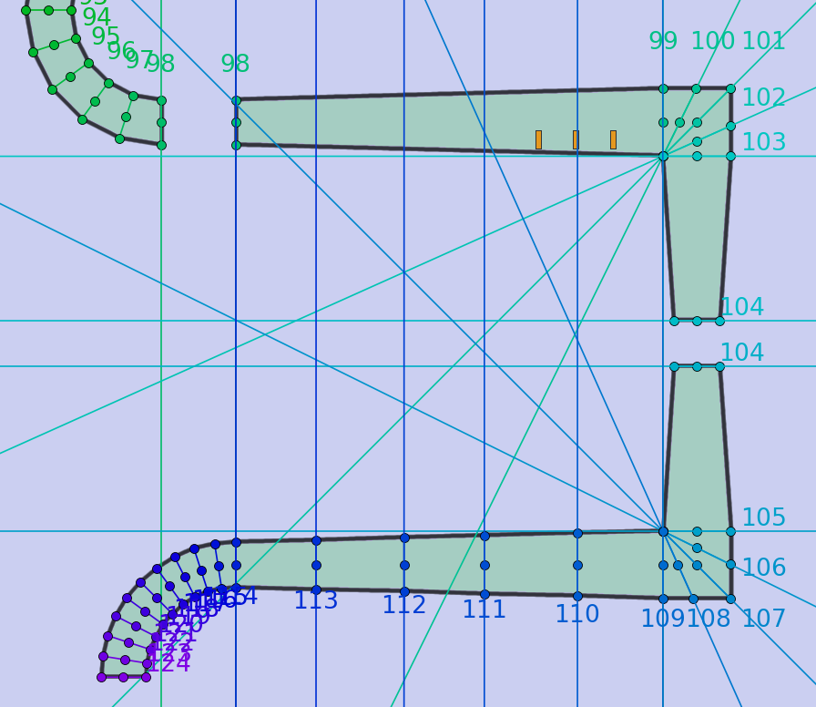

Extending every single checkpoint line can make our maps confusing, so for later maps, we'll only extend the most relevant checkpoint lines.

Checkpoint status is actually more fine-grained than a simple checkpoint number. The game also has a concept of **track distance** - the length of the track from one location to another location. This is the same measurement as the "rest" number displayed in Chapters 2, 4, 5, and 6. The game can always calculate your track distance from the start of the lap, by looking at your current checkpoint and your distance to the next checkpoint boundary.  

Two more details. At a gap like checkpoint 98, you'll notice the map has two lines labeled 98. This means you must cross the entire gap to advance forwards from checkpoint status 97 to 98, or backwards from 98 to 97. Track distance does not include gaps. Finally, as seen at the end of Serial Gaps, branching paths each have their own set of checkpoints, but they are usually very similar.

Now that we've laid out some checkpoint basics, let's see how the game decides what you can and can't skip with aerial movement:

## Checkpoint advancement rules

1. **How to advance one checkpoint:** If your checkpoint status is a number *x*, and you move in front of the 3D plane of checkpoint *x+1*, then your checkpoint status is updated to *x+1*.
   - The same applies for advancing backwards.
1. **Cross up to 9 checkpoints out of order:** If your checkpoint status is *x*, you are in front of checkpoints *x+2*...*x+k*, and you move in front of checkpoint *x+1*, then your checkpoint status is updated to *x+k*.
   - But if this is true for *k >= 10*, your checkpoint will not advance at all.
   - The same applies for advancing backwards.
1. **Advance up to d meters with track contact:** If you make contact with the top or side of the track, then you will advance to the checkpoint associated with that part of the track, regardless of whether you're in front of the previous checkpoints.
   - But if this advances your checkpoint status by more than *d* meters of track distance, your machine will explode.
   - *d* depends on the track, but it's usually around 1000 meters.
   - There is no distance restriction for advancing backwards with a landing.

We're slightly simplifying things when using expressions like *x+k*. When advancing past checkpoint 0, it's actually *(x+k) mod (number of checkpoints)* instead of *x+k*.

## Example: Serial Gaps

What's your checkpoint status as you use the jump plates to jump across here? (X marks represent landing points.)

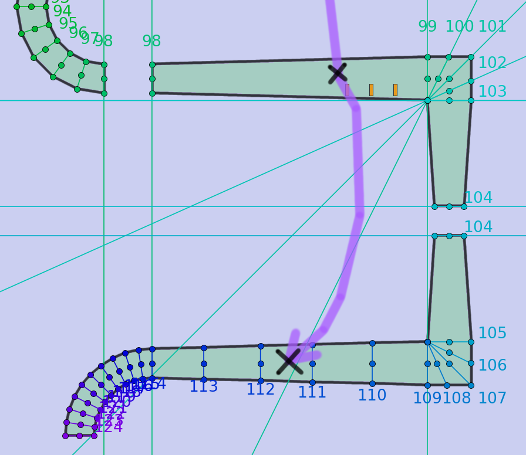

Making contact with the track always sets our checkpoint status to the checkpoint of the track we touched. The first landing point is between checkpoints 98 and 99, so our checkpoint status becomes 98.

Then we use the jump plate. During the entirety of this jump, our checkpoint status is 98. Why? Because we didn't cross checkpoint 99. As long as we stay in the air, if we miss a single checkpoint, we won't advance. It doesn't matter that we crossed a bunch of checkpoints from 100 onward.

If we're still at 98 before landing, is it safe to land?

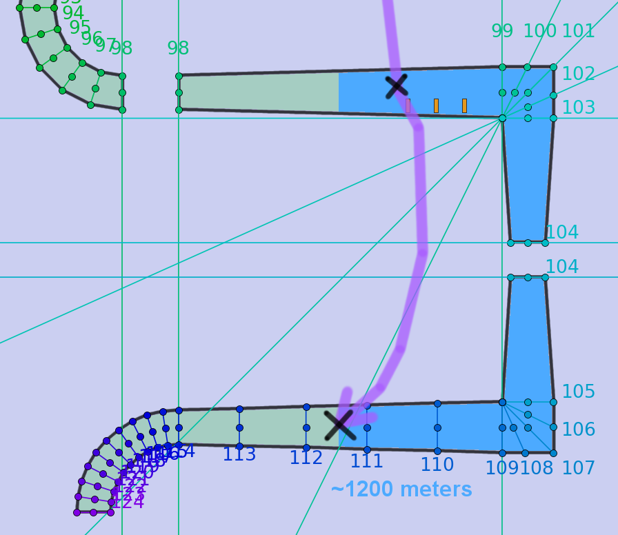

Yes, it's safe. In Serial Gaps, you can use track contact to advance up to ~1511 meters without having your machine explode. The map shows a jump that advances roughly 1200 meters.

Notice the start location of the track distance measurement (highlighted in blue). The allowed track distance isn't measured from your jump point to your landing point. It's measured from your checkpoint status just before landing to your landing point. During this jump, the checkpoint-status number stayed at 98, but the exact checkpoint-status location was moving between checkpoints 98 and 99.

If your jump looks something like this, your machine will explode:

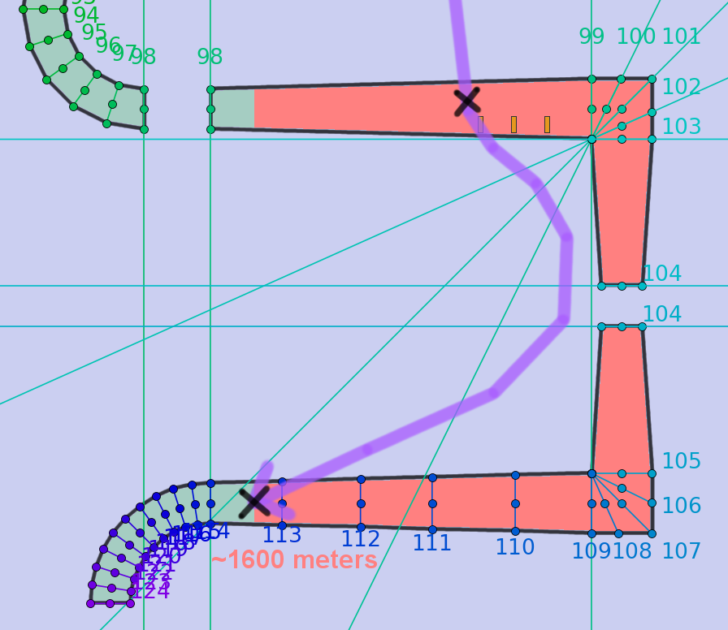

The map shows a jump that tries to advance roughly 1600 meters. That's above the limit (again, about 1511 meters) that you're allowed to skip with track contact in Serial Gaps.

Again, note the start of the track distance measurement (highlighted in red). Our landing point was only 200 meters farther than last time, but our pre-landing checkpoint location became farther back as well, adding another 200 meters to the distance.

Obviously, jumping all the way to the branching paths is going to end in an explosion, too.

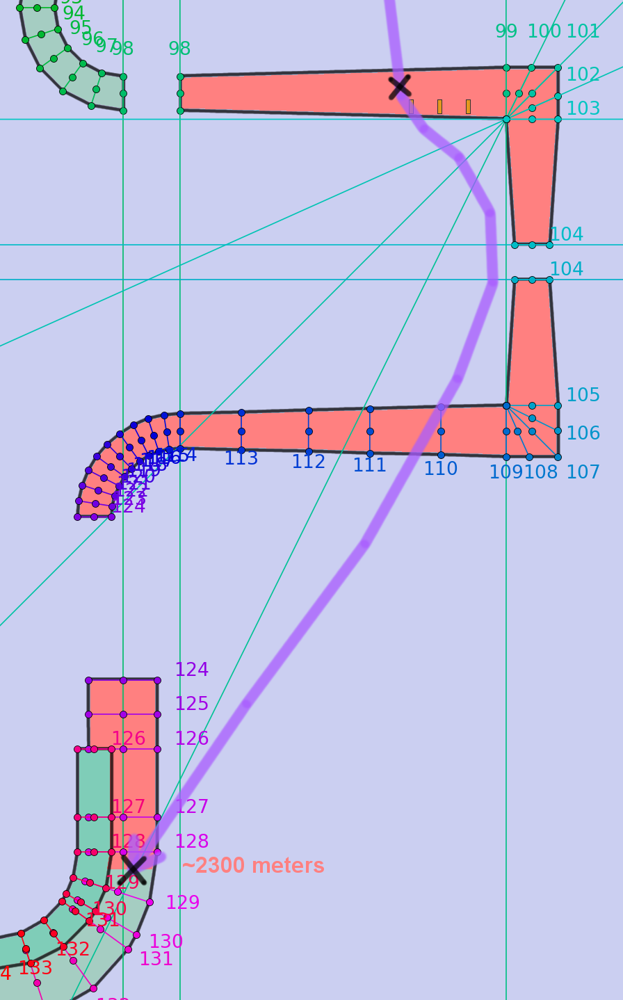

In order to jump that far, we must cross checkpoint 99.

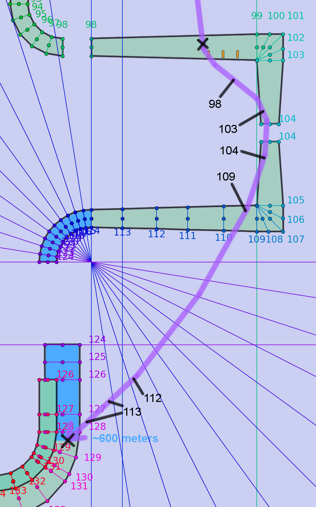

Remember, we can cross up to 9 checkpoints out of order in the air, so it's fine to cross in backwards order: 103, 102, 101, 100, and then 99. Once we've crossed all of those, our checkpoint will snap to 103. Similarly, we can cut the next corner and end up at 109. Then we can cross the next few checkpoints in order to reach 113.

Crossing 114 doesn't advance though. At that point, we're already in front of checkpoints 115-124, so the "Up to 9 checkpoints out of order" rule applies, and the game keeps us stuck at 113.

That's fine, though. Even with our checkpoint stuck at the last part of 113, our landing only advances about 600 meters. So this landing is perfectly safe.

## Retirements not related to checkpoints

What happened here?

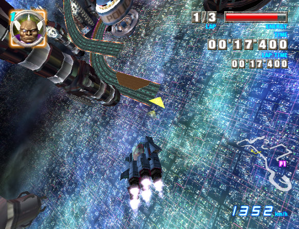
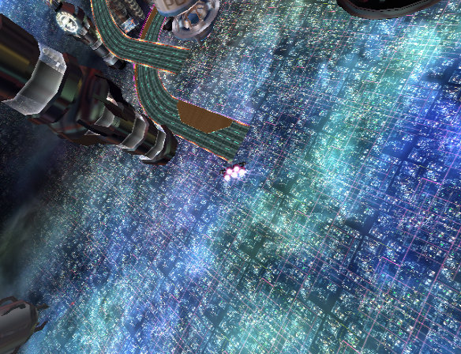
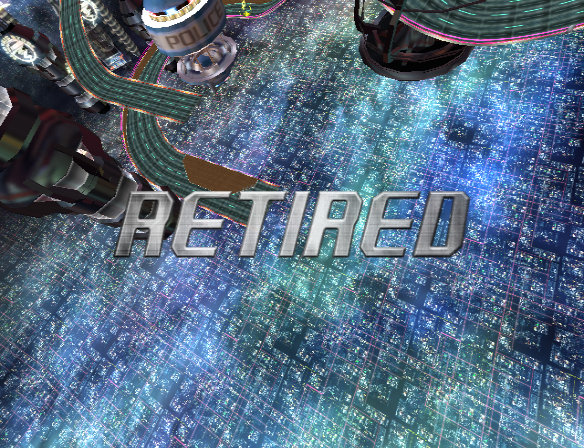

This has nothing to do with checkpoint locations or checkpoint status. We simply passed an out-of-bounds plane. When that happens, we're considered "Off course", and we get that fixed-camera effect.

How about here?

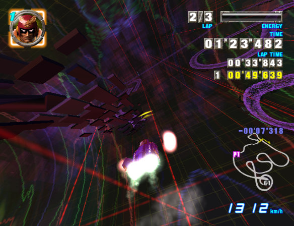
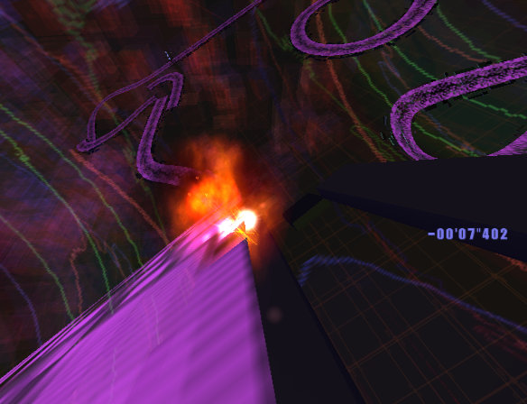

When you're airborne and touching the underside of the track, you lose energy steadily. And at zero energy, this makes your machine explode "Off course" instantly for some reason. The same thing happens when you get stuck sideways on a rail.
