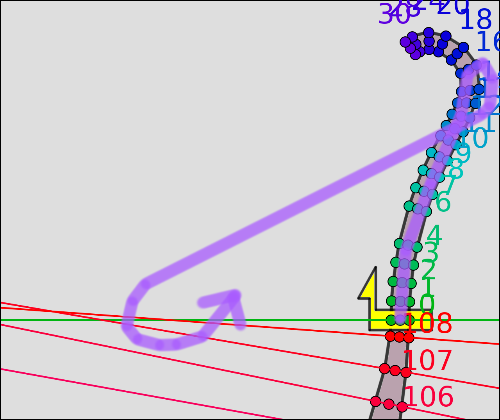
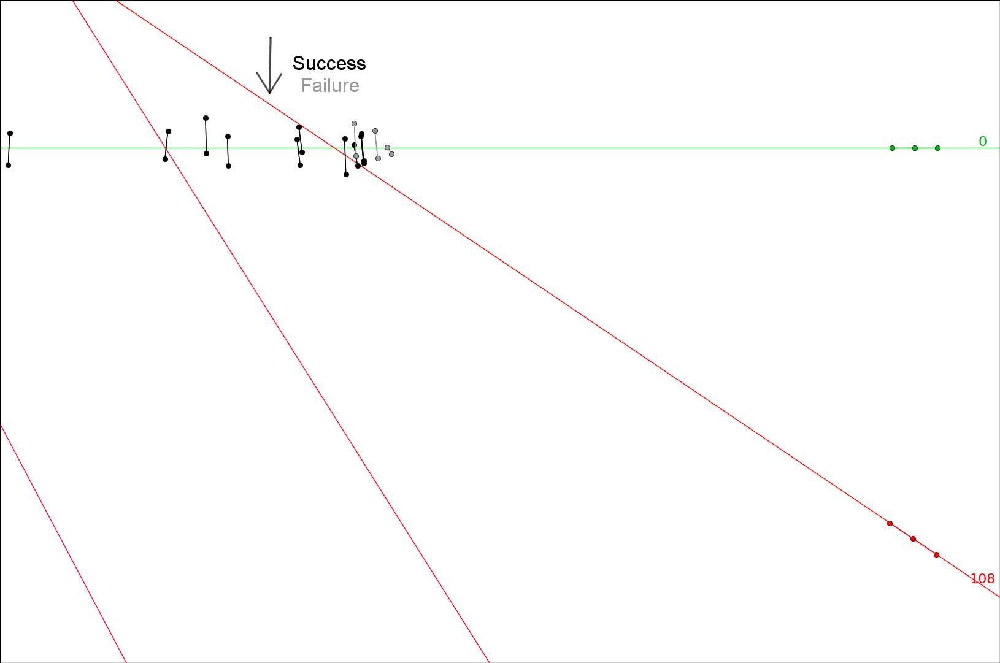

# Aeropolis: Screw Drive - Wide crossing

Videos:

- [kanata - 0'22"244](https://www.youtube.com/watch?v=5k4_OZ16gtU)
- [RichardTaro - 0'23"478](https://www.youtube.com/watch?v=GBBXpnUnu44)
- [Juniorain - 0'26"810](https://www.youtube.com/watch?v=1X8WTqnDmng)

- Lift off of the track.
- Ensure that your checkpoint is located before the first turn, not after it.
- Fly out wide to the right.
- Cross the finish line backwards when you're far enough from the line.

  - There is a particular building that you should use as a visual guide; you will be flying close to this building. Watch a video and you'll see.
  
- Get a little closer to the finish line, and cross the line forwards to complete the lap.

  - If you're positioned correctly, both crossings can be done in a single left-turning stride. To ensure your forward crossing is close enough to the finish line, you may want to hold the control stick only halfway during this stride.
  - You must be above the finish line when crossing forwards, or the lap will not complete.
  
- Land on the track (in front of the finish line). Lift off again and repeat the flying route.

The backward crossing works when you're left of the intersection of checkpoints 108 and 0. It may also work when you're between the intersection and the finish line, but you need to be lucky.

It's not a good idea to cross too far left, for two reasons:

  - You won't be able to do both the backward crossing and forward crossing in a single left-turning stride. Remember, the forward crossing basically works wherever the backward crossing doesn't, and vice versa.
  - When you're far enough left, all the buildings will disappear from view, and it's easy to get lost.
