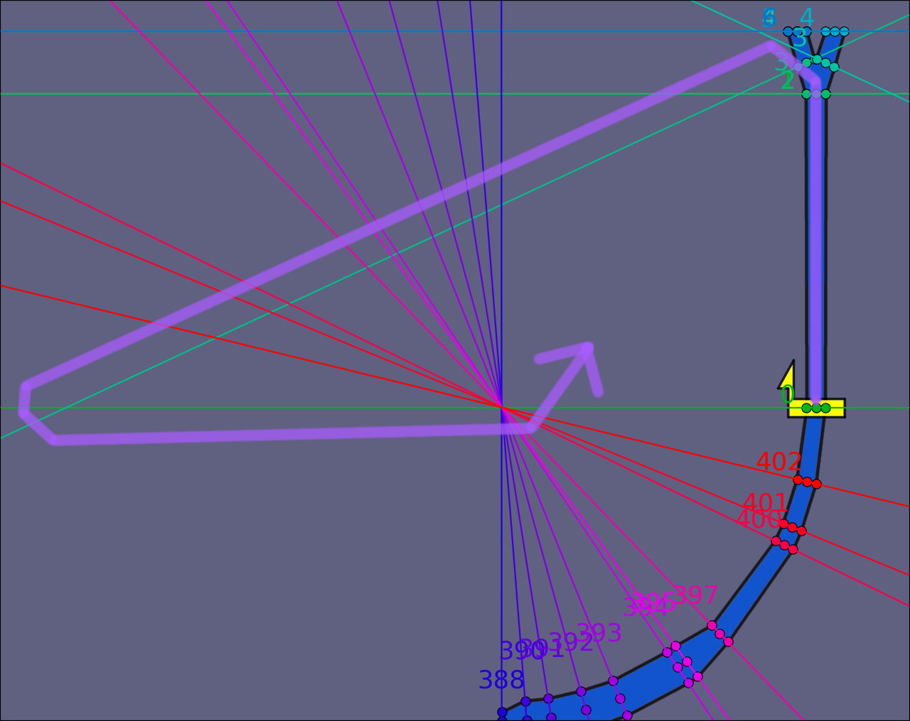
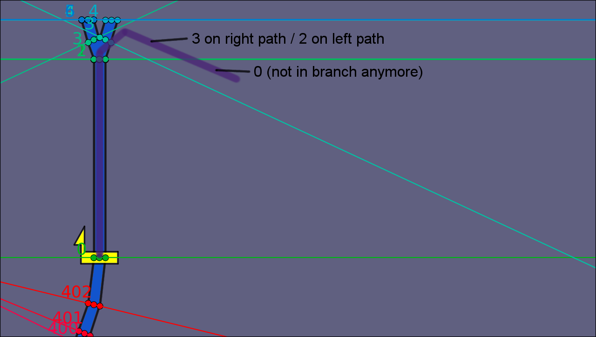

# Casino Palace: Double Branches - First turn lap skip

Videos:

- [yoshifan - 1'13"392](https://www.youtube.com/watch?v=4AMMGqHiEes)

- Go left on the first branch, and lift off of the track.
- Fly backwards out wide, staying in front of checkpoint 3.
- Cross the finish line backwards.
- Fly to the right of the 388-402 intersection point.
  - In particular, crossing to the right of 397 updates your checkpoint to the end of the lap. This step is necessary because you can't cross more than 9 checkpoints (in this case 3, 2, 1, 0, 402, ..., 398) out of order.
- Cross the finish line forwards (while above the finish line) to complete the lap.
- Land on the track (in front of the finish line). Lift off again and repeat the flying route.

## Only the left path works

The two paths on the first branch are symmetrical, and each path has its own set of checkpoints. Therefore, you might assume that this flying route could work with either path. In reality, though, this flying route only works on the left path, not the right path.

This is because the left path is the primary path of this branch. When you're in the air in a branching area, GX seems to assume you are on the primary path.

So even if you stay in front of the right side's checkpoint 3, your checkpoint status will change as soon as you cross checkpoint 2, and the game will stop tracking checkpoints within the branch.

